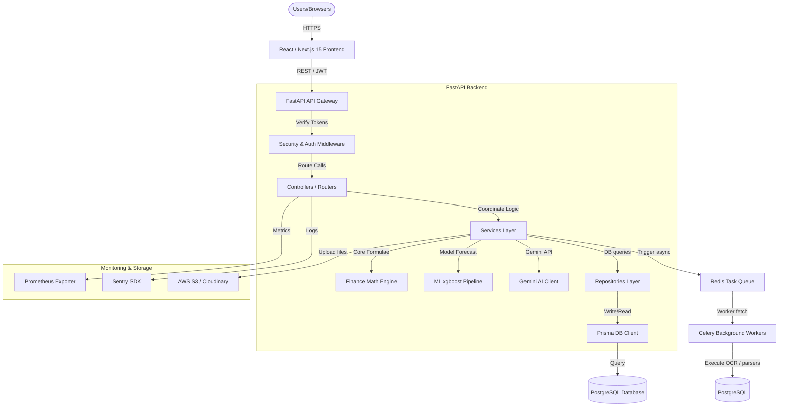

# System Architecture

Below is the visual system layout showcasing Gateway, Authentication checking, Service Layers, database caching, background Celery workers, and Monitoring tools.

```mermaid
graph TD
    User([Users/Browsers]) -->|HTTPS| NextJS[React / Next.js 15 Frontend]
    NextJS -->|REST / JWT| Gateway[FastAPI API Gateway]
    
    subgraph FastAPI Backend
        Gateway -->|Verify Tokens| Security[Security & Auth Middleware]
        Security -->|Route Calls| Controller[Controllers / Routers]
        Controller -->|Coordinate Logic| Service[Services Layer]
        Service -->|Core Formulae| Finance[Finance Math Engine]
        Service -->|Model Forecast| ML[ML xgboost Pipeline]
        Service -->|Gemini API| AI[Gemini AI Client]
        Service -->|DB queries| Repo[Repositories Layer]
        Repo -->|Write/Read| DBClient[Prisma DB Client]
    end

    DBClient -->|Query| Postgres[(PostgreSQL Database)]
    Service -->|Trigger async| TaskQueue[Redis Task Queue]
    TaskQueue -->|Worker fetch| Celery[Celery Background Workers]
    Celery -->|Execute OCR / parsers| db_task[(PostgreSQL)]

    subgraph Monitoring & Storage
        Controller -->|Metrics| Prometheus[Prometheus Exporter]
        Controller -->|Logs| Sentry[Sentry SDK]
        Service -->|Upload files| S3Srv[AWS S3 / Cloudinary]
    end
```
